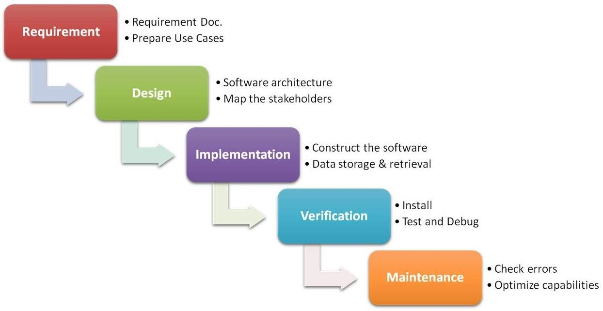
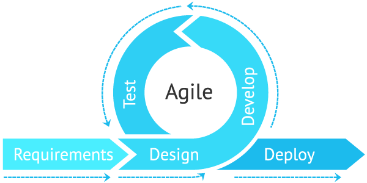
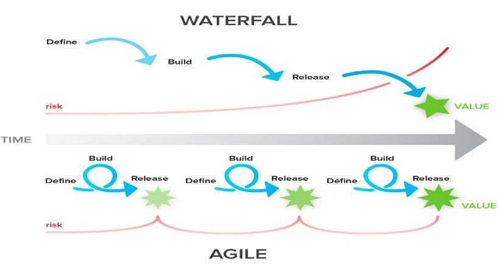

Todo empresa tem objetivos de negócio e o desenvolmento de software vem auxiliar esse processo.

## Modelo padrão (Watterfall, cascata)
Só permite que o projeto avance quando uma fase está inteiramente completa.

## Modelo Ágil
Software construído por partes (incremental) e cada parte executa-se em um ciclo (iterativo)

## Diferenças

## Escopos
| Tradicional      | Ágil |   
|------------------|------|
| Escopo definido na fase inicial   do projeto (Preditivo) | Escopo definido ao longo   do projeto (Adaptativo) |
| Projeto é controlado por fases e marcos. | Projeto é controlado por funcionalidades |
| Cliente só vê o software funcionando na fase   final do projeto | Cliente pode ver a parte do software funcionando   na parte inicial do projeto |
| Resistência a mudanças | Mudanças constantes de acordo com   feedbacks contínuos |

---
Desta forma no modelo tradicional você corre o risco de descobrir que estava errado depois de meses. Com Scrum pode descobrir em no máximo 30 dias. 